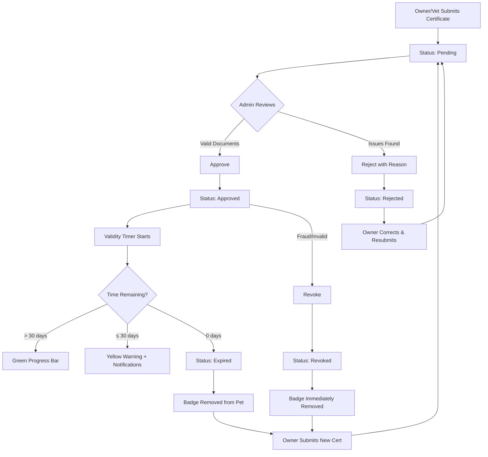

# Health Certifications

The Health Certifications module allows administrators to manage and verify pet health certificates submitted by veterinarians or pet owners. This ensures that pets listed on the platform have valid, up-to-date health documentation.

> **Access:** All roles
>
> | Role | Permissions |
> |------|-------------|
> | Super Admin | Full access |
> | Admin | Full access |
> | Moderator | View, Edit |
> | Viewer | View only |

---

## Certifications Table

The main view displays all health certification submissions in a data table.

| Column | Description |
|--------|-------------|
| Pet Name | Name of the pet the certification belongs to |
| Vet Info | Veterinarian name and clinic |
| Location | Country and city where the certification was issued |
| Cert Date | Date the certification was issued by the vet |
| Documents | Number of attached certification documents |
| Status | Current certification status badge |

### Table Actions

- Click any row to open the **Detail Drawer** on the right side.
- Use the action buttons in the last column for quick approve/reject.
- Sort by any column by clicking the column header.

---

## Filters

The filter bar above the table provides four filter options:

### Status Filter

Filter certifications by their current status:

| Status | Badge Color | Description |
|--------|-------------|-------------|
| Pending | Orange | Awaiting admin review |
| Approved | Green | Certification verified and active |
| Rejected | Red | Certification did not pass review |
| Revoked | Dark Red | Previously approved certification invalidated |
| Expired | Grey | Certification validity period has ended |

### Species Filter

Filter by pet species:

- Dog
- Cat
- Bird
- Rabbit
- Other

### Country Filter

Select one or more countries to filter by the location where the certification was issued.

### City Filter

Narrow down further by selecting specific cities within the chosen country.

> **Tip:** Filters are combinable. For example, filter by Status: Pending + Species: Dog + Country: Germany to see all pending dog certifications from Germany.

---

## Detail Drawer

Clicking a certification row opens a detail drawer on the right side of the screen. The drawer contains comprehensive information organized into sections.

### Status Banner

At the top of the drawer, a colored banner displays:

- Current status with badge icon
- Date of last status change
- Name of the admin who last actioned the certification (if applicable)
- Rejection or revocation reason (if applicable, displayed in a warning alert)

### Pet Information Section

| Field | Description |
|-------|-------------|
| Pet Name | Registered name of the pet |
| Species | Species of the pet |
| Breed | Breed of the pet |
| Date of Birth | Pet's date of birth |
| Microchip ID | Unique microchip identifier (if available) |
| Owner | Name of the pet's owner with link to their profile |

### Veterinary Details Section

| Field | Description |
|-------|-------------|
| Veterinarian Name | Full name of the issuing vet |
| Clinic Name | Name of the veterinary clinic |
| Clinic Address | Full address of the clinic |
| License Number | Vet's professional license number |
| Phone | Clinic contact phone number |
| Email | Clinic contact email (if provided) |

> **Tip:** Verify the license number against your country's veterinary licensing database when reviewing certifications from unfamiliar clinics.

### Validity Progress Bar

Below the veterinary details, a progress bar visualizes the certification's validity period:

1. The bar spans from the **Cert Date** (start) to the **Expiry Date** (end).
2. The current date is indicated by a marker on the bar.
3. Color coding:
   - **Green:** More than 30 days remaining
   - **Yellow:** 30 days or fewer remaining
   - **Red:** Expired
4. Percentage of validity consumed is displayed as text.

### Documents Grid

The documents section displays uploaded certification files in a grid layout.

1. Each document shows as a thumbnail card with the file name below.
2. Click any thumbnail to open the **Image Preview** overlay.
3. In the preview overlay:
   - Use zoom in/out controls to inspect details.
   - Navigate between documents with left/right arrows.
   - Download the original file using the download button.
   - Press **Escape** to close the preview.
4. Supported formats: JPEG, PNG, PDF.

> **Tip:** Look for official veterinary stamps, signatures, and license numbers on certification documents. Generic or template documents without these elements should be flagged for rejection.

---

## Approving a Certification

To approve a health certification:

1. Open the certification detail drawer by clicking the row.
2. Review the veterinary details for completeness and plausibility.
3. Inspect all uploaded documents in the documents grid.
4. Click the **Approve** button at the bottom of the drawer.
5. In the confirmation dialog:
   - Review the summary of what you are approving.
   - The expiry date is calculated automatically based on certification type.
   - Click **Confirm**.

### Approval Checklist

Before approving, verify:

- [ ] Veterinarian name and license number are present
- [ ] Clinic details are complete and verifiable
- [ ] Documents are legible and contain official stamps/signatures
- [ ] Certification date is recent (within the last 12 months)
- [ ] Pet information on the document matches the platform record
- [ ] No signs of document tampering or forgery

### What Happens After Approval

- The certification status changes to **Approved**.
- A validity period is set based on the certification type.
- The pet's profile displays a health certification badge.
- The owner receives a notification confirming approval.
- The validity progress bar becomes active in the detail drawer.

---

## Rejecting a Certification

To reject a health certification:

1. Open the certification detail drawer.
2. Identify the issue(s) with the submission.
3. Click the **Reject** button at the bottom of the drawer.
4. In the rejection dialog:
   - Enter a **Rejection Reason** in the text area. This field is required.
   - Be specific about what needs to be corrected.
5. Click **Confirm Rejection**.

### Common Rejection Reasons

| Reason | Example Message |
|--------|----------------|
| Illegible documents | "The uploaded document is too blurry to read. Please upload a clearer scan or photo." |
| Missing vet details | "The certificate does not include the veterinarian's license number. Please resubmit with complete vet credentials." |
| Expired certification | "This certification was issued more than 12 months ago. Please obtain and upload a current certificate." |
| Mismatched pet info | "The pet name on the certificate does not match the registered pet name. Please verify and resubmit." |
| Incomplete documents | "Only page 1 of 3 was uploaded. Please upload all pages of the certification." |

### What Happens After Rejection

- The certification status changes to **Rejected**.
- The rejection reason is displayed to the pet owner.
- The owner receives a notification with the reason.
- The owner may submit a new certification to replace the rejected one.

> **Tip:** Always provide actionable feedback. Tell the owner exactly what to fix so they can correct the issue in one resubmission.

---

## Revoking a Certification

Revocation is used when a previously approved certification is found to be invalid, fraudulent, or no longer applicable.

1. Navigate to the certification (filter by Status: Approved if needed).
2. Open the detail drawer.
3. Click the **Revoke** button (only visible for Approved certifications).
4. In the revocation dialog:
   - Enter the **Reason for Revocation**. This field is required.
   - Acknowledge that this action is immediate and cannot be undone.
5. Click **Confirm Revocation**.

### When to Revoke

- Fraudulent documentation discovered after approval
- Veterinary license found to be invalid or revoked
- Pet owner reports the certification was submitted in error
- Regulatory authority flags the certification

### What Happens After Revocation

- The health certification badge is immediately removed from the pet's profile.
- The certification status changes to **Revoked**.
- The revocation reason is stored and visible in the detail drawer.
- The owner is notified via email and in-app notification.
- The owner must submit a new certification if they wish to restore the badge.

> **Tip:** Revocation is a serious action that affects the pet's trust signals on the platform. Ensure you have sufficient evidence before proceeding.

---

## Understanding Validity and Expiry

Health certifications have a defined validity period that determines how long the certification remains active after approval.

### How Validity Works

1. When a certification is approved, the system calculates an expiry date.
2. The validity period depends on the certification type:
   - General health certificate: 12 months
   - Vaccination certificate: Varies by vaccine schedule
   - Breeding fitness certificate: 6 months
3. The **Validity Progress Bar** in the detail drawer shows time remaining visually.

### Expiry Notifications

The system sends automatic notifications as expiry approaches:

| Days Before Expiry | Notification |
|-------------------|--------------|
| 30 days | First reminder to owner to renew |
| 14 days | Second reminder with urgency |
| 7 days | Final warning |
| 0 days | Certification expired notification |

### After Expiry

- The certification status automatically changes to **Expired**.
- The health badge is removed from the pet's profile.
- The expired certification remains in history for reference.
- The owner can submit a new certification at any time.

> **Tip:** Monitor the certifications table filtered by "Approved" and sorted by expiry date to proactively identify certifications nearing expiry in your region.

---

## Bulk Actions

For efficient processing of multiple certifications:

1. Use the checkboxes on the left side of the table to select multiple rows.
2. The bulk action bar appears at the top of the table.
3. Available bulk actions:
   - **Approve All** -- Approves all selected pending certifications with default expiry.
   - **Export** -- Downloads selected certifications as a CSV report.

> **Tip:** Bulk approve should only be used when you have individually verified each selected certification's documents. Never bulk approve without reviewing documents.

---

## Certification Lifecycle Diagram

The following diagram illustrates the complete lifecycle of a health certification:

---

## Frequently Asked Questions

**Q: Can I edit the expiry date of an approved certification?**
A: No. To change the expiry, you must revoke the current certification and ask the owner to resubmit.

**Q: What if a certification document is in a language I cannot read?**
A: Escalate to an admin who reads that language, or request the owner provide a certified translation.

**Q: Can a pet have multiple active certifications?**
A: Yes. A pet may have both a general health certificate and specific vaccination certificates active simultaneously.

**Q: Who receives the rejection/revocation notifications?**
A: The pet's registered owner receives all notifications via email and in-app messaging.
